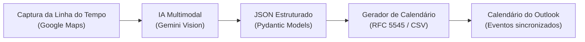

# 📍 AIRoute2Cal

> **Converta capturas de tela da Linha do Tempo do Google Maps em compromissos estruturados no Calendário do Outlook através de IA.**

[](https://github.com/Julianmel/AIRoute2Cal)
[](LICENSE)
[](https://python.org)
[](#)

---

## 🎯 O Problema

Profissionais externos, técnicos de campo, consultores e agrônomos frequentemente precisam documentar seus trajetos de deslocamento e visitas no calendário corporativo do **Microsoft Outlook** ou realizar prestações de contas de quilômetros rodados.

Embora o aplicativo do **Google Maps** registre todo o histórico na **Linha do Tempo** (*Timeline*), copiar manualmente os dados de cada trecho, calcular horários e criar dezenas de compromissos no calendário é uma tarefa repetitiva e suscetível a erros.

O **AIRoute2Cal** automatiza esse processo: a partir de um simples print da Linha do Tempo, uma IA multimodal extrai com precisão todas as origens, destinos, distâncias e horários, exportando diretamente arquivos prontos para o Outlook (`.ics` e `.csv`).

---

## ✨ Funcionalidades Principais

* 📸 **Extração Inteligente com Visão Computacional:** Processa telas de smartphones de qualquer resolução via **Google Gemini Vision**, eliminando as falhas comuns de OCR tradicional.
* 🚗 **Detecção Completa de Trajetos:** Identifica de onde saiu, para onde foi, horários exatos de início e término, duração em minutos e distância em quilômetros.
* 📍 **Detecção de Paradas e Visitas:** Extrai nomes de estabelecimentos, endereços e tempo de permanência em cada parada do dia.
* 📅 **Exportação para o Microsoft Outlook:**
  * **iCalendar (`.ics` - RFC 5545):** Importe com duplo clique ou adicione ao calendário do Outlook Desktop, Novo Outlook ou Web.
  * **Arquivo CSV:** Compatível com o assistente nativo de importação do Outlook.
* 💰 **Gestão de Custos / Reembolso de KM:** Cálculo do valor estimado de reembolso de combustível baseado em um valor configurável por quilômetro rodado (R$/km).
* 🖥️ **Duas Interfaces Prontas:**
  * **Aplicação Web (Streamlit):** Interface gráfica amigável com upload de imagem, pré-visualização em tabela e botões de download.
  * **CLI (Linha de Comando):** Para automação em lote e uso via terminal.

---

## 🔄 Fluxo de Funcionamento



---

## 📁 Estrutura do Projeto

```text
AIRoute2Cal/
├── app.py                      # Aplicação Web Streamlit
├── cli.py                      # Utilitário de linha de comando
├── requirements.txt            # Dependências Python
├── .env.example                # Exemplo de configuração de variáveis de ambiente
├── .gitignore
├── LICENSE                     # Licença MIT
├── README.md                   # Documentação do projeto
├── examples/                   # Imagens de exemplo para testes
│   └── sample_timeline.jpeg
├── src/
│   ├── __init__.py
│   ├── models.py               # Modelos de dados Pydantic
│   ├── extractor.py            # Extração via IA Gemini
│   └── calendar_generator.py   # Gerador de arquivos .ICS e .CSV
└── tests/
    └── test_calendar_generator.py
```

---

## 🚀 Como Executar Localmente

### 1. Pré-requisitos
* Python 3.10 ou superior instalado.
* Chave gratuita da API do Gemini (obtida em [Google AI Studio](https://aistudio.google.com/)).

### 2. Clonar o repositório
```bash
git clone https://github.com/Julianmel/AIRoute2Cal.git
cd AIRoute2Cal
```

### 3. Criar e ativar o ambiente virtual
```bash
python -m venv venv

# Windows (PowerShell):
.\venv\Scripts\Activate.ps1

# Linux / MacOS:
source venv/bin/activate
```

### 4. Instalar as dependências
```bash
pip install -r requirements.txt
```

### 5. Configurar as credenciais
Copie o arquivo `.env.example` para `.env` e preencha sua chave:
```env
GEMINI_API_KEY="sua_chave_do_google_ai_studio"
DEFAULT_TIMEZONE="America/Sao_Paulo"
```

---

## 💻 Modos de Uso

### Modo 1: Interface Web (Recomendado)
Para iniciar o aplicativo com interface visual no navegador:
```bash
streamlit run app.py
```
1. Faça o upload do print da Linha do Tempo.
2. Clique em **"Extrair Deslocamentos e Paradas"**.
3. Baixe o arquivo `.ics` desejado ou importe diretamente para o Outlook.

### Modo 2: Linha de Comando (CLI)
Para processar uma imagem diretamente pelo terminal:
```bash
python cli.py examples/sample_timeline.jpeg --output-dir ./output
```
Opções disponíveis:
* `--only-displacements`: Exporta apenas os trajetos dirigindo.
* `--date YYYY-MM-DD`: Fornece uma data explícita se a tela mostrar apenas "Hoje".
* `--output-dir -o`: Pasta de destino dos arquivos `.ics` e `.csv`.

---

## 📥 Como Importar os Arquivos no Outlook

1. **Duplo Clique (.ics):** Dê dois cliques no arquivo `.ics` gerado. O Outlook abrirá perguntando se deseja salvar os compromissos no seu calendário.
2. **Novo Outlook / Outlook Web:** Vá em **Calendário** > **Adicionar calendário** > **Fazer upload do arquivo** > Selecione o `.ics`.
3. **Outlook Clássico:** Vá em **Arquivo** > **Abrir e Exportar** > **Importar/Exportar** > escolha **Importar um arquivo iCalendar (.ics)** ou **CSV**.

---

## 🗺️ Roadmap Futuro

- [x] Extração estruturada de trajetos e visitas via IA multimodal
- [x] Geração de arquivos iCalendar (`.ics`) e CSV compatíveis com Outlook
- [x] Interface gráfica com Streamlit e CLI
- [ ] Colagem direta da área de transferência (`Ctrl+V`) na web
- [ ] Integração direta com conta corporativa via **Microsoft Graph API** (`OAuth2`)
- [ ] Processamento em lote de múltiplos prints (semana/mês completo)
- [ ] Relatório consolidado em PDF para prestação de contas

---

## 📄 Licença

Distribuído sob a licença **MIT**. Consulte o arquivo [LICENSE](LICENSE) para obter mais informações.
